# Claude Agent SDK 周报 Demo 全流程讲解

这份文档现在是这个项目唯一保留的“主说明文档”。

它把原来的两份内容合到了一起，覆盖两种阅读需求：

1. 小白第一次接触时，先搞懂这个项目是什么、怎么运行
2. 已经能跑起来之后，顺着真实执行顺序去读源码

如果你只看一份文档，就看这一份。

## 1. 一句话先讲明白

这个项目不是普通的 `git log` 统计脚本。

它是一个 Agent Demo：

1. 你启动一个 TypeScript CLI 程序
2. 这个程序调用 `Claude Agent SDK`
3. SDK 让模型自己调用受控的 `git` 工具读取仓库提交
4. 模型把读到的内容整理成中文 Markdown 周报
5. 主程序把周报打印到终端，并保存成文件

默认项目是 `weass-b-mono`，也可以通过 `--repo=<关键词>` 在 `/Users/sunzhennan/Desktop/Code` 一级目录里模糊匹配其他 Git 仓库。

所以它的重点不是“我手写了多少 git 统计规则”，而是：

- 宿主程序负责准备环境、约束和输出
- agent 负责自己调用工具分析证据并写报告

## 2. 先知道 5 个最基本概念

### 2.1 Node.js 是什么

你可以把 Node.js 理解成“运行 JavaScript / TypeScript 程序的环境”。

没有它，这个项目跑不起来。

### 2.2 npm 是什么

`npm` 是 Node.js 自带的包管理工具。

它负责两件事：

1. 安装依赖
2. 执行 `package.json` 里定义好的脚本命令

### 2.3 TypeScript 是什么

TypeScript 就是“带类型的 JavaScript”。

这个项目的源码都放在 `src/` 目录下，扩展名是 `.ts`。

### 2.4 Claude Agent SDK 是什么

你可以把它理解成一个“agent 外壳”。

它负责：

- 启动 agent
- 把 prompt 发给模型
- 管理工具调用
- 把结果事件流回传给你的程序

### 2.5 百炼 Anthropic 兼容接口是什么

这个项目虽然用的是 `Claude Agent SDK`，但底层模型服务不是直接走 Claude 官方接口，而是走百炼提供的 Anthropic 兼容接口。

也就是：

- agent 框架是 `Claude Agent SDK`
- 模型服务是百炼

## 3. 项目目录怎么看

当前项目最关键的文件只有这些：

```text
claude-agent-weekly-report-demo/
├── package.json
├── tsconfig.json
├── README.md
├── PROJECT_WALKTHROUGH.md
├── CLAUDE_AGENT_SDK_CAPABILITIES.md
├── .env.example
├── src/
│   ├── index.ts
│   ├── dateRange.ts
│   └── prompt.ts
└── reports/
    └── weekly-summary-weass-b-mono-2026-03-30-to-2026-04-01.md
```

每个文件的作用：

- `package.json`
  定义怎么安装、怎么编译、怎么运行
- `tsconfig.json`
  定义 TypeScript 编译规则
- `src/index.ts`
  主入口，负责把所有步骤串起来
- `src/dateRange.ts`
  负责处理时间范围
- `src/prompt.ts`
  负责生成给 agent 的提示词
- `reports/*.md`
  运行后生成的最终报告

## 4. 第一次运行时你应该怎么做

### 第 1 步：进入项目目录

```bash
cd /Users/sunzhennan/Desktop/Code/claude-agent-weekly-report-demo
```

### 第 2 步：确认 Node 版本

```bash
nvm use
node -v
```

你至少要看到 `v18.x.x`，更推荐 `v22.x.x`。

如果提示本机还没有对应版本，就先执行：

```bash
nvm install 22
nvm use
```

### 第 3 步：安装依赖

```bash
npm install
```

这一步是在下载：

- `Claude Agent SDK`
- TypeScript 编译相关依赖

### 第 4 步：准备百炼配置

这个项目现在会自动读取根目录的 `.env`，所以如果 `.env` 已经写好了，通常不需要每次手动 `export`。

如果你想临时覆盖，也可以这样：

```bash
export BAILIAN_API_KEY="你的百炼 API Key"
export BAILIAN_MODEL="qwen3.5-plus"
```

### 第 5 步：运行周报命令

```bash
npm run report -- --repo=weass-b --since=2026-03-30 --until=2026-04-01
```

运行成功后会有两个结果：

1. 终端里打印一份 Markdown 周报
2. `reports/` 目录里落下一份 `.md` 文件

## 5. 先从命令入口理解整个链路

你平时执行的是：

```bash
npm run report -- --repo=weass-b --since=2026-03-30 --until=2026-04-01
```

这条命令真正对应的是 [package.json](./package.json)：

```json
"scripts": {
  "build": "tsc -p tsconfig.json",
  "report": "npm run build --silent && node dist/index.js"
}
```

它的意思是：

1. 先执行 `npm run build`
2. `build` 会调用 `tsc -p tsconfig.json`
3. TypeScript 把 `src/*.ts` 编译成 `dist/*.js`
4. 再执行 `node dist/index.js`
5. 你命令里写的 `--repo`、`--since`、`--until` 继续传给 `dist/index.js`

所以你脑子里最好先有这条链：

`npm run report` -> `npm run build` -> `tsc` -> `dist/index.js` -> `src/index.ts`

## 6. 从“命令”到“报告”的完整流程图

```mermaid
flowchart TD
    A["你在终端执行<br/>npm run report -- --repo=weass-b --since=2026-03-30 --until=2026-04-01"] --> B["package.json 的 report 脚本启动"]
    B --> C["先执行 npm run build"]
    C --> D["TypeScript 编译器把 src/*.ts 编译成 dist/*.js"]
    D --> E["执行 node dist/index.js"]
    E --> F["index.ts 进入 main()<br/>开始主流程"]
    F --> G["检查 Node 版本"]
    G --> H["解析命令行参数<br/>读取 repo / since / until / help"]
    H --> I["读取项目 .env"]
    I --> J["prepareRuntimeConfig()<br/>读取百炼 Key<br/>强制设置百炼网关<br/>选择模型"]
    J --> K["resolveRepoPath()<br/>默认项目或模糊匹配仓库"]
    K --> L["ensureGitRepo()<br/>检查目标目录存在且是 Git 仓库"]
    L --> M["resolveDateRange()<br/>计算实际时间范围"]
    M --> N["buildSystemPrompt() + buildUserPrompt()<br/>生成给 agent 的提示词"]
    N --> O["query(...options)<br/>调用 Claude Agent SDK"]
    O --> P["Agent 在受控权限下工作<br/>只允许 Bash(git:*) 和 Read"]
    P --> Q["Agent 执行 git log<br/>拿到时间范围内的非合并提交"]
    Q --> R["Agent 执行 git show --stat --name-only<br/>读取每个提交影响文件"]
    R --> S["Agent 对重点提交进一步读取 patch"]
    S --> T["Agent 生成中文 Markdown 周报"]
    T --> U["主程序接收 result 事件"]
    U --> V["终端打印报告"]
    V --> W["写入 reports/weekly-summary-项目-开始日期-to-结束日期.md"]
```



## 7. 真正开始读源码时，先从哪里看

第一次读源码时，不建议一上来就从文件第一行硬啃。

最推荐的阅读顺序是：

1. 先看 [package.json](./package.json)
   理解命令入口和脚本链路
2. 再看 [src/index.ts](./src/index.ts) 最底部的 `main().catch(...)`
   先知道程序从哪里开始、从哪里统一收口
3. 再完整看 [src/index.ts](./src/index.ts) 里的 `main()`
   这是整个项目的主线
4. 再看 [src/index.ts](./src/index.ts) 里的 `runWeeklyReportAgent()`
   理解 agent 是怎么被真正启动的
5. 再看 [src/index.ts](./src/index.ts) 里剩余辅助函数
   这些函数是在给主线做准备
6. 再看 [src/dateRange.ts](./src/dateRange.ts)
   理解时间范围是怎么处理的
7. 最后看 [src/prompt.ts](./src/prompt.ts)
   理解 agent 为什么会按这个方式去分析 git 和写报告

## 8. `src/index.ts` 怎么线性阅读

### 8.1 先看文件最底部

第一次读 [src/index.ts](./src/index.ts) 时，最适合先看最底部：

```ts
main().catch(error => {
  const message = error instanceof Error ? error.message : String(error);
  console.error(message);
  process.exitCode = 1;
});
```

这段代码说明：

1. 整个 CLI 从 `main()` 开始
2. 所有未捕获错误都在这里统一兜底
3. 最终只打印一条清楚、直观的错误信息

也就是说，`main()` 就是这个程序的总导演。

### 8.2 再回到文件顶部看准备工作

文件顶部主要有三类准备：

1. `import`
   引入 Node 内置能力、Claude Agent SDK、本地模块
2. 常量
   比如默认仓库路径、默认百炼网关、默认模型、项目根目录、报告目录
3. 类型
   比如 `CliArgs` 和 `SdkEvent`

这里最关键的一点是：

- `index.ts` 负责主流程
- `dateRange.ts` 负责时间
- `prompt.ts` 负责 prompt

从结构上就已经把职责分清楚了。

### 8.3 然后完整看 `main()`

`main()` 是这个项目最重要的函数。

它的真实执行顺序是：

1. `ensureSupportedNodeVersion()`
2. `parseCliArgs(...)`
3. 如果 `--help`，就 `printHelp()` 后直接返回
4. `loadProjectEnvFile()`
5. `prepareRuntimeConfig()`
6. `resolveRepoPath(...)`
7. `ensureGitRepo(...)`
8. `resolveDateRange(...)`
9. 打印启动信息
10. `runWeeklyReportAgent(...)`
11. 创建 `reports/` 目录
12. 写入最终 Markdown 文件
13. 把报告正文和元信息打印到终端

如果你第一次读代码，只要你能把这 12 步说顺，这个项目主线你就已经抓住了。

### 8.4 `main()` 里的每一步到底在干什么

#### 第 1 步：检查 Node 版本

调用的是：

```ts
ensureSupportedNodeVersion();
```

这不是业务逻辑，而是环境前置检查。

原因很简单：

`Claude Agent SDK` 要求 `Node 18+`。如果版本太低，程序不是优雅失败，而是可能报出很难懂的内部错误，比如：

```text
Object not disposable
```

所以这里先拦一下，能把环境问题和业务问题区分开。

#### 第 2 步：解析命令行参数

调用的是：

```ts
const cliArgs = parseCliArgs(process.argv.slice(2));
```

它负责解析：

- `--repo`
- `--help`
- `--since`
- `--until`

这里用 `slice(2)` 是因为：

- `process.argv[0]` 通常是 Node 路径
- `process.argv[1]` 通常是脚本路径
- 从第 2 个开始才是你真正传入的参数

#### 第 3 步：帮助命令提前返回

如果你执行的是：

```bash
npm run report -- --help
```

程序只会打印帮助信息，然后直接结束。

它不会继续：

- 读 `.env`
- 查 git 仓库
- 调用 agent

#### 第 4 步：读取 `.env`

调用的是：

```ts
await loadProjectEnvFile();
```

这一步是为了让项目可以直接从根目录 `.env` 里拿配置，而不是要求你每次都手动 `export`。

#### 第 5 步：整理运行时配置

调用的是：

```ts
const runtimeConfig = prepareRuntimeConfig();
```

这是整个项目“稳定跑在百炼上”的关键步骤。

它会：

1. 读取 `BAILIAN_API_KEY`
2. 在程序内部映射成 SDK 习惯读取的 `ANTHROPIC_*` 变量
3. 强制把网关锁死到百炼
4. 确定模型名称

为什么要强制锁死网关。

因为你的终端里可能残留着别家 Anthropic 兼容网关配置。如果不覆盖，SDK 可能就会偷偷跑偏。

#### 第 6 步：先解析目标仓库，再检查它是否合法

调用的是：

```ts
const resolvedRepoPath = await resolveRepoPath(cliArgs.repoArg);
const verifiedRepoPath = await ensureGitRepo(resolvedRepoPath);
```

这里分两层：

1. 不传 `--repo`，就继续分析默认仓库 `weass-b-mono`
2. 传了 `--repo=<关键词>`，就去 `/Users/sunzhennan/Desktop/Code` 一级目录里模糊匹配 Git 仓库

匹配规则故意保持简单：

- 完全相等优先
- 前缀匹配其次
- 包含匹配最后

如果只有一个最高优先候选，就自动选中。  
如果最高优先候选有多个：

- 在 TTY 终端里让用户交互选择
- 在非 TTY 环境下列出候选并退出

默认仓库路径仍然是：

```text
/Users/sunzhennan/Desktop/Code/weass-b-mono
```

#### 第 7 步：计算时间范围

调用的是：

```ts
const dateRange = resolveDateRange({
  sinceArg: cliArgs.sinceArg,
  untilArg: cliArgs.untilArg,
});
```

它会统一产出：

- `since`
- `until`
- `humanRange`

分别给：

1. git 参数
2. 终端展示

#### 第 8 步：打印启动信息

程序会打印：

- 目标仓库
- 分析范围
- 模型网关
- 模型名称

这些内容不是业务必需，但对排查问题和现场演示都很有用。

#### 第 9 步：真正调用 agent

调用的是：

```ts
const report = await runWeeklyReportAgent(...)
```

从这一刻开始，主程序不再自己手写：

- `git log`
- `git show`
- 分类规则
- Markdown 拼接

这些工作全部交给 agent 去做。

#### 第 10 步：确保报告目录存在

调用的是：

```ts
await mkdir(REPORTS_DIR, { recursive: true });
```

意思是：

- 目录不存在就创建
- 已经存在也不要报错

#### 第 11 步：写入报告文件

程序会把最终报告写到：

```text
reports/weekly-summary-项目名-开始日期-to-结束日期.md
```

这样不同项目、不同时间范围的报告不会互相覆盖。

#### 第 12 步：终端再打印一份

除了文件落盘，程序还会把报告正文打印到终端，并补充：

- `Session ID`
- `Turns`
- `Cost`

这样 live demo 时不需要切文件也能展示结果。

## 9. `runWeeklyReportAgent()` 为什么是 Agent 逻辑的核心

如果说 `main()` 是总导演，那么 `runWeeklyReportAgent()` 就是“把任务正式交给 agent”的执行层。

它接收的不是 git 结果，而是上下文：

- `repoPath`
- `since`
- `until`
- `humanRange`
- `model`

这说明当前架构的思路是：

- 主程序负责准备环境和上下文
- agent 负责自己调用工具、收集证据、组织报告

### 9.1 `query()` 是真正的 SDK 入口

核心调用是：

```ts
const stream = query({
  prompt: buildUserPrompt(input),
  options: {
    cwd: input.repoPath,
    maxTurns: 8,
    permissionMode: "acceptEdits",
    allowedTools: ["Bash(git:*)", "Read"],
    systemPrompt: buildSystemPrompt(),
    model: input.model,
  },
});
```

这里每个字段的意义都很明确：

- `prompt`
  这次任务的具体输入
- `cwd`
  agent 的工作目录，固定到目标仓库
- `maxTurns`
  最多允许跑多少轮
- `permissionMode`
  使用 SDK 的标准非交互模式
- `allowedTools`
  只开放 `git` 相关 bash 命令和 `Read`
- `systemPrompt`
  长期规则
- `model`
  实际使用的百炼模型

最重要的一点是：

虽然 agent 有 Bash 能力，但它不是“任意 Bash”，而是被限制成：

```text
Bash(git:*)
```

这就是这个 demo 的安全边界。

### 9.2 为什么这里要读事件流

`query()` 返回的不是一次性结果，而是一个异步事件流。

所以源码里会这样写：

```ts
for await (const event of stream) { ... }
```

这表示 SDK 的工作过程是：

1. 初始化
2. 多轮工具调用
3. 最后返回结果

当前项目只真正关心两类事件：

- `system/init`
- `result`

### 9.3 为什么“空结果”也算失败

源码里会把下面这种情况视为失败：

```ts
const markdown = (resultEvent.result ?? "").trim();
if (!markdown) {
  throw new Error("Claude Code SDK 返回了空结果。");
}
```

原因很简单：

这个项目的最终产物必须是一份 Markdown 周报。

如果最后没有文字返回，对用户来说就等于失败。

## 10. `prepareRuntimeConfig()` 在解决什么问题

这部分是整个项目“适配百炼”的关键。

它现在只读取一个对使用者最直观的变量名：

- `BAILIAN_API_KEY`

然后它会：

1. 把 key 同时写到 `ANTHROPIC_API_KEY`
2. 把 key 同时写到 `ANTHROPIC_AUTH_TOKEN`
3. 强制设置 `ANTHROPIC_BASE_URL`
4. 读取 `BAILIAN_MODEL`，没有就用默认值 `qwen3.5-plus`

为什么要这么做。

因为 `Claude Agent SDK` 默认是 Anthropic 风格，而你现在实际上走的是百炼兼容接口，所以需要由程序内部做一层最小映射。但对外只保留一个变量名，项目会更简单。

## 11. `loadProjectEnvFile()` 相关逻辑在解决什么问题

这一组函数包括：

- `loadProjectEnvFile()`
- `applyEnvContent()`
- `stripWrappingQuotes()`

它们的作用是：

1. 读取项目根目录 `.env`
2. 逐行解析
3. 把配置写进 `process.env`

这里没有额外引入 `dotenv`，是因为当前需求很简单，只需要支持：

- 空行
- 注释
- `KEY=value`
- 最外层单双引号

这样做的好处是：

- 少一个依赖
- 逻辑更直观
- 更容易讲给小白听

## 12. `ensureGitRepo()` 在解决什么问题

这个函数的线性逻辑是两步：

### 第一步：检查路径存在

如果目录都不存在，就直接报：

```text
目标路径不存在
```

### 第二步：检查是不是 Git 仓库

它会调用：

```bash
git rev-parse --show-toplevel
```

如果目录不是 git 仓库，这条命令会失败。

这样用户拿到的错误会比较清晰，不会把“路径不存在”和“不是 git 仓库”混在一起。

## 13. `parseCliArgs()` 为什么是手写的

这个函数支持的输入只有四类：

- `--repo=...`
- `--help`
- `--since=...`
- `--until=...`

当前版本把参数格式统一收紧成：

```bash
--repo=weass-b
--since=2026-03-30
--until=2026-04-01
```

不再支持：

```bash
--repo weass-b
--since 2026-03-30
--until 2026-04-01
```

因为参数面非常小，所以这里没有引入 `commander` 或 `yargs`。

这是一种有意识的取舍：

- 功能简单
- 手写更清楚
- 更适合 demo 和讲解

## 14. `src/dateRange.ts` 怎么读

`src/dateRange.ts` 是整个项目的时间工厂。

主流程里只调用了一句：

```ts
resolveDateRange(...)
```

但真正的时间处理都在这个文件里。

### 14.1 `resolveDateRange()`

这是总入口。

它先拿默认时间范围，再用用户参数覆盖，最后统一产出：

- git 能直接用的时间字符串
- 文件名用的日期标签
- 控制台展示用的时间范围

### 14.2 `buildWeeklyDateRange()`

这是“默认本周范围”的计算器。

这里最大的重点是：

这个项目不是按“当前机器时区随便算”，而是强制按 `Asia/Shanghai` 理解“本周”。

它的做法是：

1. 先把当前时间平移到上海时区视角
2. 在这个视角里算本周一 00:00
3. 再平移回真实时间点

这样可以避免 JavaScript `Date` 在时区计算上的很多坑。

### 14.3 `parseUserDateInput()`

它支持：

- `YYYY-MM-DD`
- `YYYY-MM-DD HH:mm`
- `YYYY-MM-DD HH:mm:ss`
- ISO 时间

如果用户只写日期：

- `since` 自动补到当天 `00:00:00`
- `until` 自动补到当天 `23:59:59`

所以你写：

```bash
--since=2026-03-30 --until=2026-04-01
```

程序会自动把它理解成一整天范围，而不是零点到零点。

## 15. `src/prompt.ts` 怎么读

`src/prompt.ts` 只有两个核心函数，但它决定了 agent 的行为边界。

### 15.1 `buildSystemPrompt()`

它定义长期规则。

也就是：

- 你是谁
- 你必须遵守什么原则
- 你最后必须输出什么结构

这里最关键的规则有：

1. 只能基于 git 证据下结论
2. 不允许编造
3. 输出必须是中文 Markdown
4. 必须包含 6 个一级标题
5. 必须先 `git log`，再 `git show`
6. 只对少量重点提交看 patch
7. 对高风险路径更敏感

### 15.2 `buildUserPrompt()`

它定义这次具体任务。

包括：

1. 分析哪个仓库
2. 分析哪段时间
3. 推荐优先使用哪些 git 命令
4. 忽略 merge commit
5. 最终只返回 Markdown 正文

所以可以这样记：

- `system prompt` = 长期规则
- `user prompt` = 这次任务输入

## 16. 为什么这个项目算 Agent，而不是脚本

普通脚本通常是：

1. 主程序自己执行 `git log`
2. 主程序自己写分类规则
3. 主程序自己拼接 Markdown

这个项目不是这样。

它的思路是：

1. 宿主程序给 agent 一个任务目标
2. 宿主程序给 agent 一组工具权限
3. 宿主程序给 agent 一个输出格式要求
4. agent 自己决定如何收集证据和组织结论

所以分享时你可以这样说：

“我不是手写周报逻辑，而是用 Claude Agent SDK 封装了一个受控 agent，让它自己读取 git 证据并生成报告。”

## 17. 你可以怎样检查自己有没有跑对

按这个顺序最简单。

### 17.1 看帮助信息能不能出来

```bash
npm run report -- --help
```

如果帮助信息能正常打印，说明：

- 项目入口正常
- 编译链路正常
- 基本运行条件正常

### 17.2 看 Node 版本

```bash
node -v
```

确认是 `18+`，更推荐 `22`。

### 17.3 正式运行

```bash
npm run report -- --repo=weass-b --since=2026-03-30 --until=2026-04-01
```

### 17.4 看报告文件有没有生成

```bash
ls reports
```

## 18. 常见报错怎么理解

### 报错：`Object not disposable`

大概率不是 key 错，也不是 prompt 错，而是 Node 版本太低。

先执行：

```bash
nvm use
node -v
```

如果还是低版本，再执行：

```bash
nvm install 22
nvm use
```

### 报错：缺少 API Key

意思是：

- 没在 `.env` 或当前终端里配百炼 key

### 报错：目标路径不存在

意思是：

- 目标仓库路径错了
- 或者目录已经不存在

### 报错：目标路径不是可用的 Git 仓库

意思是：

- 目录存在
- 但不是 git 仓库

### 报错：`Claude Code SDK 返回了空结果`

这通常不是参数格式错，而是模型在多轮工具调用后没有吐出最终文本结果。

在“Claude Agent SDK + 百炼兼容模型”这条组合里，复杂多轮场景的稳定性有时不如 Claude 原生。

## 19. 你做分享时可以怎么解释这个项目

最短版本：

“我做了一个基于 Claude Agent SDK 的 CLI agent。默认分析 `weass-b-mono`，也支持通过 `--repo=<关键词>` 模糊匹配其他本地仓库，让 agent 自己调用 git 工具分析，再生成一份中文周报。底层模型走百炼的 Anthropic 兼容接口。”

稍微展开一点：

1. 宿主程序负责参数、环境变量、仓库校验和输出文件
2. Agent SDK 负责调模型和工具调用
3. Prompt 负责约束 agent 的分析方式
4. 最终产物是一份适合汇报的 Markdown 周报

## 20. 你现在最该记住的最小操作

如果以后你忘了细节，只记下面这几行就够了：

```bash
cd /Users/sunzhennan/Desktop/Code/claude-agent-weekly-report-demo
nvm use
npm install
npm run report -- --repo=weass-b --since=2026-03-30 --until=2026-04-01
```

如果 `.env` 没写好，再补：

```bash
export BAILIAN_API_KEY="你的百炼 API Key"
export BAILIAN_MODEL="qwen3.5-plus"
```

运行完成后，打开这里看报告：

```text
/Users/sunzhennan/Desktop/Code/claude-agent-weekly-report-demo/reports/
```

## 21. 最后一句总结

这个项目本质上是：

- 用 TypeScript 写了一个宿主程序
- 用 Claude Agent SDK 启动一个受控 agent
- 用百炼兼容接口提供模型能力
- 让 agent 自己分析 git 提交并生成周报

如果你能把这 4 句话讲清楚，再把 `main()` 那条主线说顺，这个项目你就已经真正理解了。
